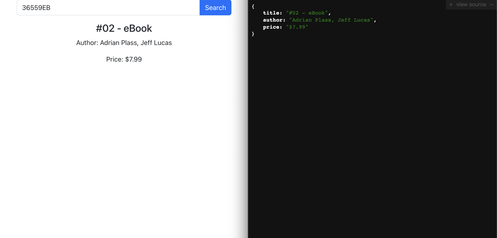

**Q: How does your system work? (if not addressed in comments in source)** 
A: The system is a full-stack application that consists of a frontend created with React and a backend developed using Express. The frontend allows the user to input a SKU and sends a request to the backend. The backend then fetches data from the provided sitemap XML, finds the URL associated with the SKU, and extracts the product details such as title, author, and price from the HTML of the found URL. The details are then sent back to the frontend and displayed to the user.

**Q: How could you scale your system to search across all sitemap files?** 
A: To scale the system to search across all sitemap files, I would implement parallel processing or distribute the search task across multiple servers. Utilizing a more efficient XML parsing method, caching frequent queries, and creating an index of the sitemaps could also help in speeding up the search across multiple sitemap files.

**Q: How will your system perform with 100 users? 10,000 users? 1,000,000 users?** 
A: With 100 users, the system is likely to perform without any noticeable lag. For 10,000 users, it may require optimization, including load balancing and caching, to maintain performance. With 1,000,000 users, a significant re-architecture would be necessary, including horizontal scaling, utilizing a Content Delivery Network (CDN), and implementing advanced caching and indexing strategies.

**Q: What documentation, websites, papers, etc did you consult in doing this assignment?** 
A: For this assignment, I consulted the official documentation of React, Express, Axios, Cheerio, and xml2js. Additionally, I utilized various online forums and resources, such as Stack Overflow, to solve specific problems.

**Q: How long did you spend on this exercise? If you had unlimited more time to spend on this, how would you spend it and how would you prioritize each item?** 
A: The exercise took approximately 2 hours. If I had unlimited time, I would prioritize refactoring the code for better maintainability, implementing extensive testing, enhancing the user interface, optimizing for performance, and adding features like keyword searches, filtering, and pagination.

**Q: If you were to critique your code, what would you have to say about it?** 
A: The code is functional but could benefit from further modularization, especially in the backend. More comprehensive error handling and logging would also be beneficial for production readiness.

**Q: How can you change your system to be updated to support simple keyword searches?** 
A: To support simple keyword searches, I would need to create a search algorithm that could find matches within the sitemap based on the provided keywords. This might require pre-processing the sitemap data into a searchable index or database. On the frontend, I would modify the user interface to accept keywords instead of SKU, and the backend would have to handle this new search logic.
